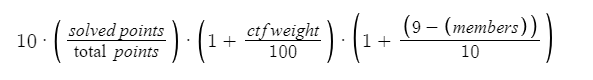

# CTFBot
A discord.py bot providing ctf platform integration and points system for
users on a Discord server. Currently, there are commands for CTFTime, CTFd APIs,
and for team setup.

This bot keeps track of what server members are doing for CTFs. There is a point
system that awards points for when members compete with the team. The bot keeps
track of statistics like number of competitions competed in, points
(from point system), ranking on server, and more.

Future Platform Integration:
- CTFx
- rCTF
- XCTF
- FacebookCTF

## Point System
The point system we have developed aims to be a reasonable system to grade a
member's value in each specific category. We have included 10 different categories
to have ratings on as we have encountered them throughout several CTF competitions.

**Categories:**
- Crypto
- Forensics
- OSINT
- Web
- Pwn/Bin
- Reverse
- HTB
- Cryptocurrency
- Network

Each of these categories will be put through the following formula to decide the
value for each user:

For each competition, the values for each category will be averages to make it equal.
To calculate the **Overall** value of a member, the bot will take the average of
all of the categories. The **Overall** value is the underlying value of the
leaderboard and determines a member's rank.

### Authors:
- itsecgary
- aldenschmidt

### Creds:
We included several utilities from NullCTF's bot. The integration of CTFTime and
CTFd is very useful to this bot and assists the point system as well.

[NullCTF Github](https://github.com/NullPxl/NullCTF)
